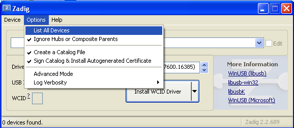
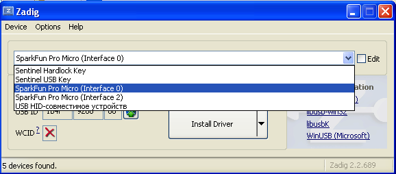
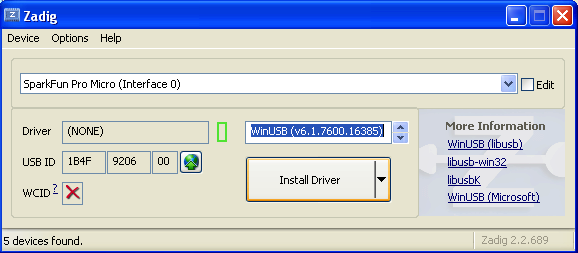
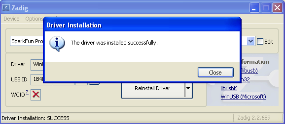
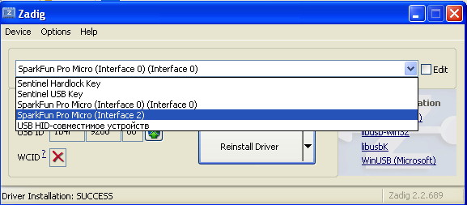
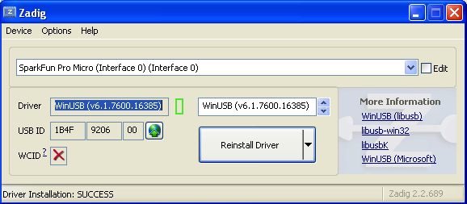

# Enable WebUSB to allow FDIM controller configuration under Windows

By default Windows locks USB device port and do not allow Chrome to interact with devices from WebUSB-enabled web pages.
In order to switch USB port to proper mode, one needs to download Zadig software and switch USB device driver to WinUSB

1. Download Zadig from (https://zadig.akeo.ie/)[https://zadig.akeo.ie/] and install it

2. 

3. 

4. 

5. 

6. 

7. 
 
